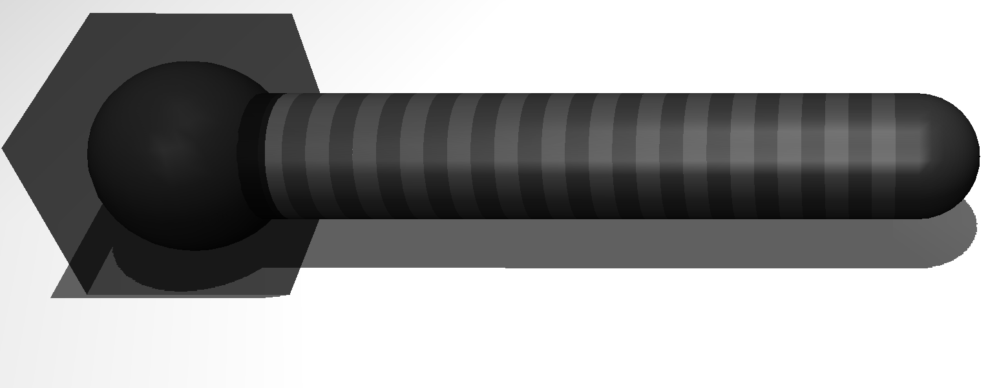
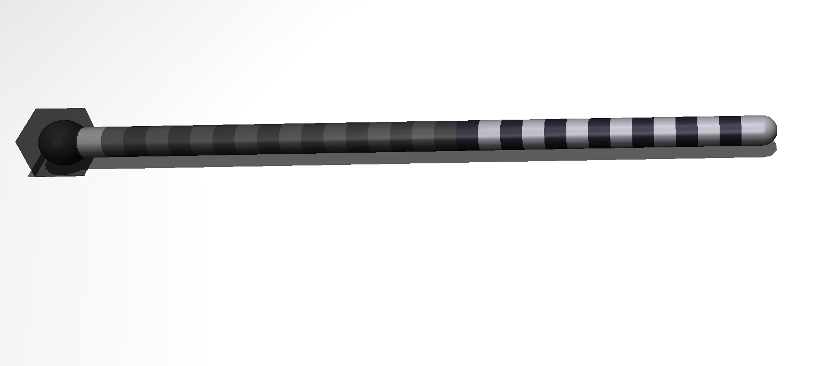
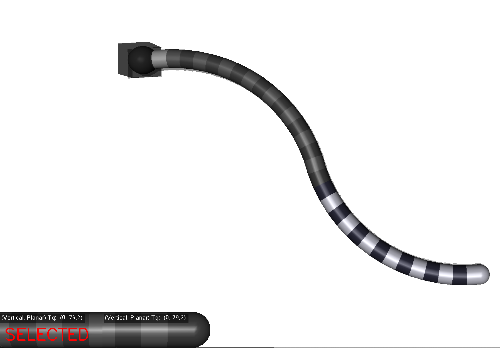
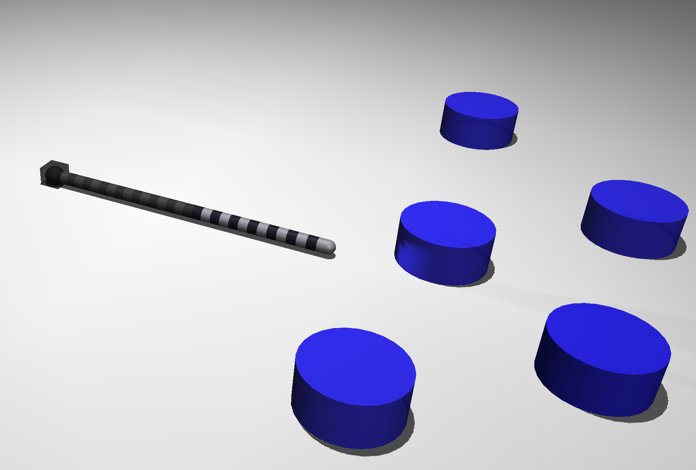
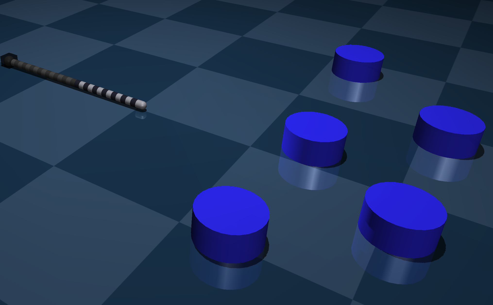
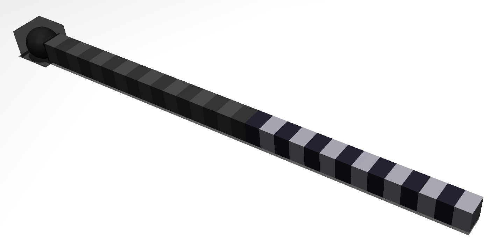
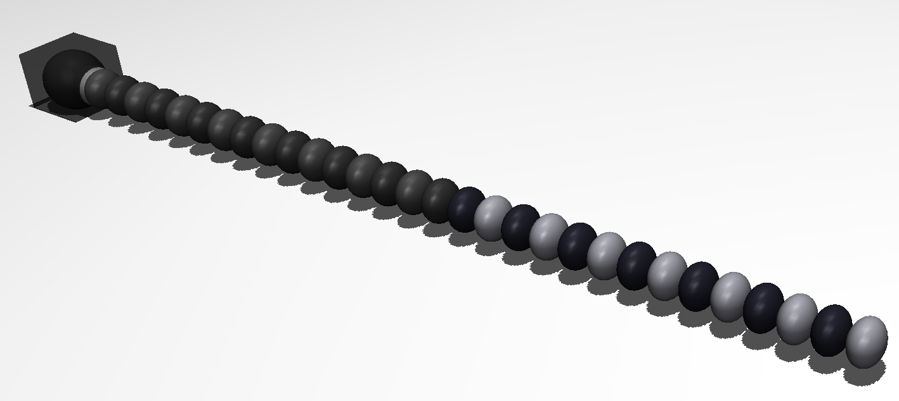

Simulation Settings
=====
.. _simSettings:

**Lock Robot in Place**
~~~~~~~~~~

Enabling this will lock the base of the robot in place. The robot will still be free to
actuate and move its backbone but it will not be able to slide or translate its base. 

**No. of Links**
~~~~~~~~~~

Specify the number of rigid links making up your robot. Each link is connected by a universal joint 
to the link in front, and behind it.
See the :ref:`Robot Simulation Model<rigid_link_model>` page to better understand this setting.

**Link Length**
~~~~~~~~~~

The length of the rigid links making up the robot.

**Radius**
~~~~~~~~~~

The radius of each rigid link. 

Ex. ``Radius: 0.140``

``Radius: 0.035`` (Default value)

**No. of Segments**
~~~~~~~~~~

Number of segments making up the robot. Each segment actuates independently to the other segments. There can only be 1-6 segments.
Each segment can actuate in 2 degrees of freedom. 

.. note::

Two segment robot with each segment actuated in opposite directions

**Movement Speed**
~~~~~~~~~~
Changes the speed of movement. This effects the linear movement of the entire robot.
This value describes the position delta each time you press "o" or "p" :ref:`keyboard controls <controls>`. It is recommended to 
keep this value small to minimize collision intersections with obstacles. Lower does result in slower movement. 

**Disable Gravity**
~~~~~~~~~~

Toggles gravity. Gravity is a 3 vector set at (0, 0, -9.81)

**Disable Obstacles**
~~~~~~~~~~

Toggles all obstacles. Useful if you want to temporarily disable your obstacles but not delete or change your taskspace file.

**Disable Floor Plane**
~~~~~~~~~~

Removes the floor plane. 

**Colour Scheme**
~~~~~~~~~~
Different colour scheme of the simulation. Has no effect on the physics.

    Clean Option (Default)

    Cinematic Option

**Shape of Links**
~~~~~~~~~~
Shape of each individual link composing the robot. ``Capsule`` is default.

    Box shape

    Ellipsoid shape

**Taskspace filename**
~~~~~~~~~~
The name of your taskspace file stored in ``MJCFS/taskspaces`` the default value is ``taskspace.conf`` which results in the simulation
reading the file in ``MJCFS/taskspaces/taskspace.conf``. See the :ref:`taskspace <taskspaceSec>` section on how to create a taskspace. If you want to use an empty taskspace,
specify an empty file.
