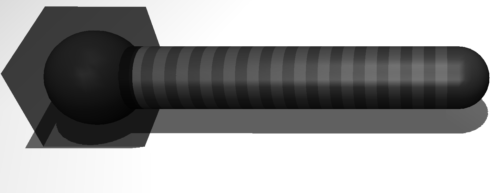
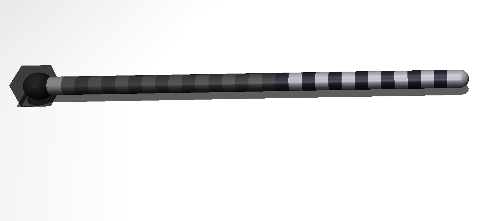

Simulation Settings
=====
.. _simSettings:

**Lock Robot in Place**

Enabling this will lock the base of the robot in place. The robot will still be free to
actuate and move its backbone but it will not be able to slide or translate its base. 

**No. of Links**

Specify the number of rigid links making up your robot. Each link is connected by a universal joint 
to the link in front, and behind it.
See the :ref:`Robot Simulation Model<rigid_link_model>` page to better understand this setting.

**Link Length**

The length of the rigid links making up the robot.

**Radius**

The radius of each rigid link. 

Ex. ``Radius: 0.140``

``Radius: 0.035`` (Default value)

**No. of Segments**

**Disable Gravity**

**Disable Obstacles**

**Disable Floor Plane**

**Colour Scheme**

**Shape of Links**

**Taskspace filename**
