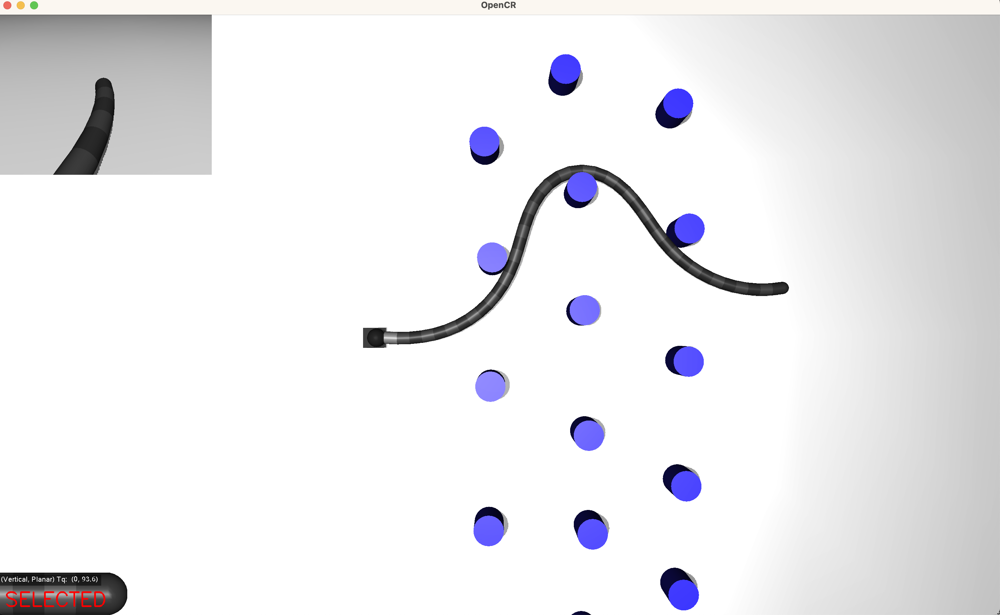

Welcome to CRL's Mujoco documentation!
===================================

**CRL-Mujoco** is a versatile simulation software for continuum robots. It is a series
of classes and functions written on top of the `Mujoco <https://mujoco.org/>`_ physics engine.
It offers fast and easy configuration of robots, taskspaces and more.

Check out the :ref:`Usage <usage>` section for further information, including
how to :ref:`install <installation>` the application.

.. image:: ./media/WingGif.gif
   :alt: StreamPlayer
   :align: center

.. note::

   This project is under active development.

Contents
--------

.. toctree::

   usage
   installation
   SimulationSettings
   rigidLink_model
   controls
