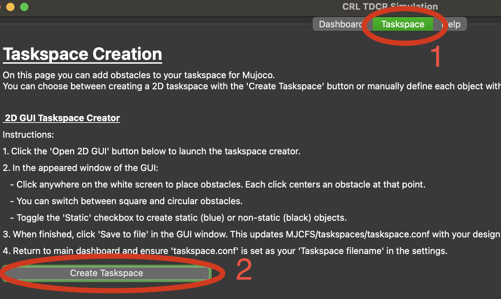
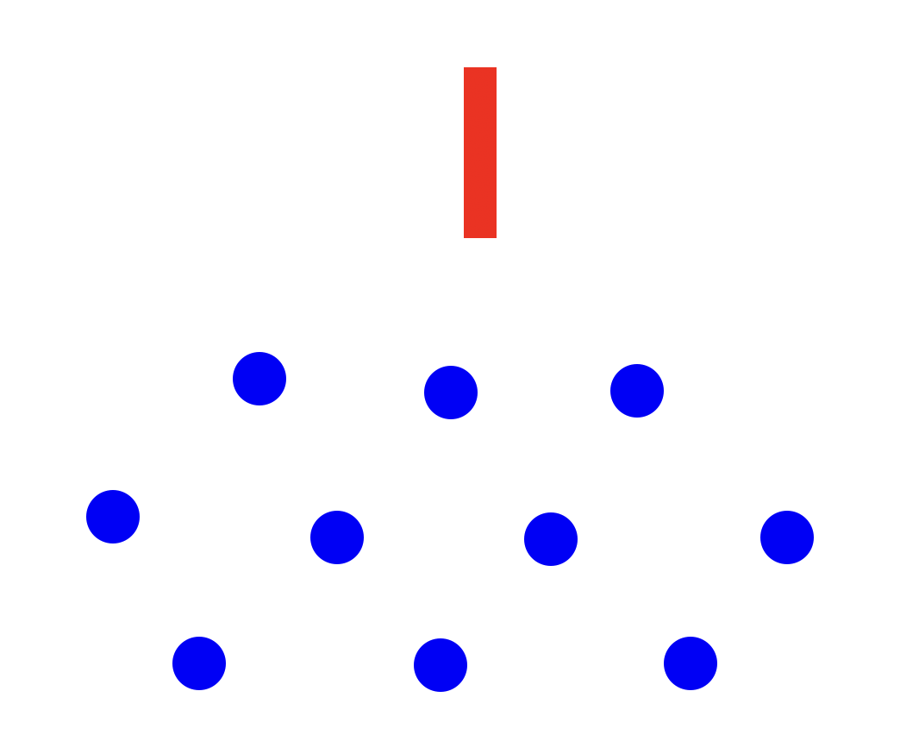
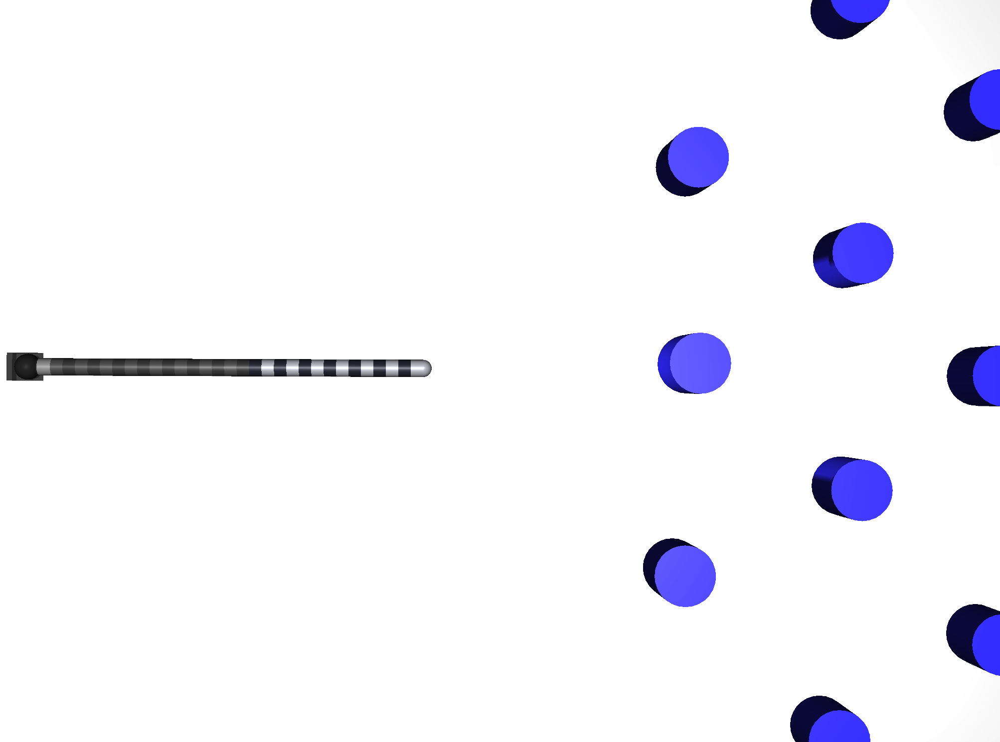

Taskspaces
=====

.. _taskspaceSec:

You have many options for creating your taskspace. 

Taskspace Tab
----------------
Your first option is to head to the taskspace tab and click...

Which will result in this.

Altneratively, you can do option 2, 

Importing your Custom CAD Models
----------------
MAKE UNLISTED YOUTUBE VIDEO OF CAD MODEL