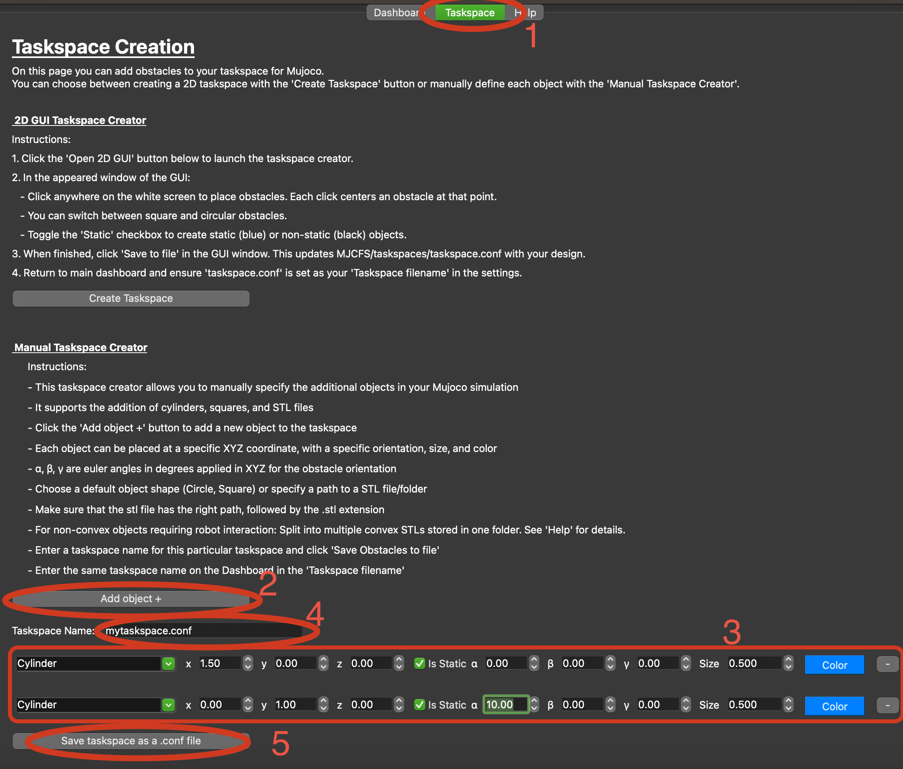
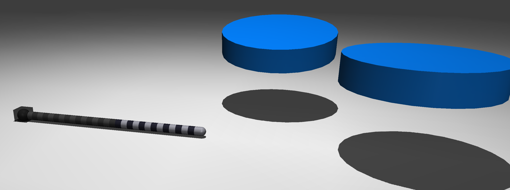

Taskspaces
=====

.. _taskspaceSec:

You have many options for creating your taskspace. 

Taskspace Tab
----------------

*Option 1*
Your first option is for 2D planar taskspaces. This method is the fastest and easiest to create a taskspace.

.. figure:: ./media/taskspaceMedia/Taskspace1.png
    :scale: 40 %

Where you can then click anywhere you want your obstacle to be. There are more instructions in the application.

.. figure:: ./media/taskspaceMedia/GUItaskspace.png
    :scale: 40 %

Lastly, on the ``dashboard`` tab you must specify exactly ``taskspace.conf`` in the ``Taskspace filename: `` entry. This is set by default.

This example will result in,

.. figure:: ./media/taskspaceMedia/SimTaskspace.png
  :scale: 40 %

*Option 2*
Alteratively, you can do option 2 also located on the taskspace tab.
This option gives you more flexibility in position, orient and more. 

Lastly, on the ``dashboard`` tab you must specify the taskspace name you set in step 4 in the ``Taskspace filename: `` entry.
The above example will result in the following simulation environment,

Importing your Custom CAD Models
----------------
Lastly, you may want more customization in your taskspace if the above methods are not enough. To load in your own custom CAD models please
view this YouTube `video <https://crl.utm.utoronto.ca/>`_.