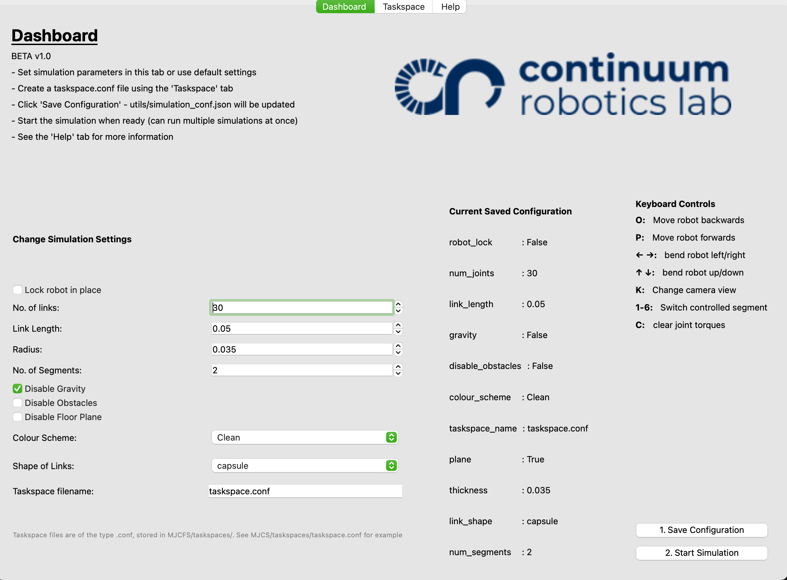

Usage
=====

.. _usage:

Starting the application
----------------
Before using, see the :ref:`Installation<Installation>` guide to get this application
installed on your system.

You have two options to run the application,

**1. GUI**

   ``$ python start.py``

From here you may tune your simulation the way you like it. See, :ref:`Simulation Settings <simSettings>`
page to find out more about what each of the settings do.

**2. Headless**

.. code-block:: console
  
  python start.py --configfile /path/to/simulation_conf.json

This method skips using the GUI and will start the application. This method may be usefull if you are,

Tabs in the GUI
---------------
